# Design: meter row store (runtime-simple attributed metrics export)

- **Date:** 2026-06-10
- **Library:** `instrument`
- **Baseline:** `be7e75e` (1.1.3, master)
- **Status:** approved design; pending implementation plan
- **Supersedes:** §5 (PR 1, approach A1) of `2026-06-09-meter-metrics-export-fixes-design.md`. §6 of that document (histogram OTLP) is unaffected and shipped as upstream PR #10.
- **Replaces implementation:** the `meter-attributed-path` branch (A1, unshipped). This design is a fresh implementation from master; A1's behavioral tests are ported as the contract.
- **Delivery:** one upstream bugfix PR to `benoitc/instrument`.

---

## 1. Why A1 is being replaced

A1 fixed the meter's two export bugs (mangled names, phantom zero) at the **render layer**: storage still held one fixed-schema vec per attribute key-set under a derived registry name, and a grouping step (`instrument_otel_streams`) re-joined them under the user-facing name on every collection.

That puts recurring work on the hot paths. Per scrape, A1:

1. builds a fresh name index — 2 persistent_term reads per instrument (`otel_name_index/0`), discarded after use;
2. renames every collected entry (map lookup each);
3. runs a grouping fold (accidentally quadratic in distinct names — `Ord ++ [N]`), per-group row appends, a `usort` label union, and a help-reconciliation scan (`first_non_empty`);
4. in Prometheus, re-computes the label union per family and pads per row.

Per attributed write, the pre-existing path (unchanged by A1) rebuilds the derived vec-name binary (`make_vec_name` runs on **every** write) and does two persistent_term gets before the NIF op.

The identity question — *which rows belong to which instrument, under what name, with what label union* — only changes at two rare moments: instrument creation and the first write of a new attribute set. A1 re-derives the answer every scrape. This design stores the answer at those two moments and makes both hot paths read-only.

### The same instrument's storage, today vs after

`requests` counter, written once with no attrs, once with `#{method, status}`, once with `#{region}`. (Storage is identical on master and the A1 branch — A1 changed the render layer, not storage; they differ only in how the base entry gets registered.)

**Today — three registry entries, two under derived names, re-joined at every scrape:**

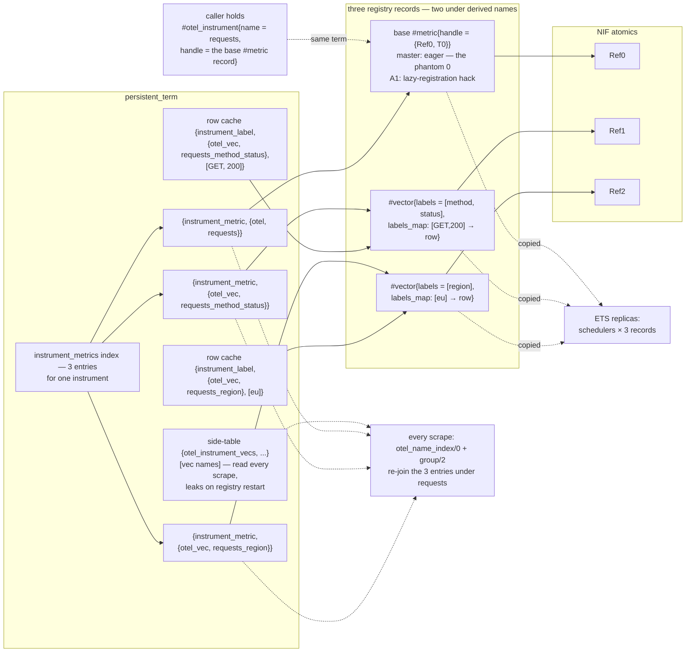

**After — one entry under the real name; identity is data, not derivation:**

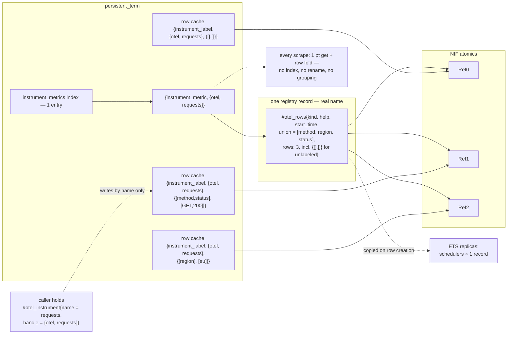

What the diff buys, structurally:

- 3 registry entries (2 with derived names) → **1 entry, real name only**; nothing to rename or re-join, ever.
- `{otel_instrument_vecs}` side-table + per-scrape `otel_name_index/0` + `group/2` → **identity stored in `#otel_rows`** (rows, union), written at creation moments.
- The base series (eager phantom on master / lazy hack on A1) → **the `{[],[]}` row**, which exists iff it was written.
- Caller handle: a full `#metric` record → **just the name**.
- Row cache keys: derived vec name + values → **real name + canonical attrs**, so the fast path needs one get instead of two.

## 2. Goals and non-goals

**Goals**

- Same externally-visible bug fixes as A1: attributed data exports under the registered name as one stream; no phantom zero series; Prometheus renders heterogeneous key-sets as one family with unioned, empty-filled labels.
- **Write fast path:** canonicalize attrs → 1 persistent_term get → 1 NIF op. Nothing else, labeled or unlabeled.
- **Collect path:** per instrument, 1 persistent_term get + 1 NIF read per row. No index building, no renaming, no grouping, no per-scrape union computation. `instrument_otel_streams` is deleted, not optimized.
- All reconciliation paid at creation moments (instrument creation; first write of a new attribute set), serialized through the existing registry gen_server pattern.

**Non-goals**

- The standalone `instrument_metric:*_vec` API and the `#vector` machinery: public, README-documented surface with its own suites — untouched. The meter simply stops borrowing it.
- No bound-instrument API (pre-resolved row handles). Noted in §10 as the future lever if the per-write canonicalization floor ever matters.
- No delta-temporality work; `#otel_instrument.temporality` is carried as today.
- No per-row `start_time` emission (stream-level only; per-row values exist in storage if ever needed — §6).

## 3. Data model

One meter instrument = **one registry entry**, registered at `create_*` under the real name, holding a flat row store:

```erlang
%% include/instrument.hrl
-record(otel_rows, {
  kind                :: counter | up_down_counter | histogram | gauge
                       | observable_counter | observable_gauge | observable_up_down_counter,
  help = <<>>         :: binary(),
  start_time          :: integer(),            %% instrument creation, ns (stream-level OTLP start_time)
  boundaries          :: [number()] | undefined, %% histograms only (views/opts/default, resolved at create)
  union = []          :: [atom() | binary()],  %% sorted union of row label names; maintained at row creation
  rows = #{}          :: #{ {Names :: list(), Values :: [binary()]} => #metric{} }
}).
```

```erlang
#metric{
  name    = {otel, Name},                     %% the user-facing name, tagged
  handle  = #otel_rows{...},
  collect = {instrument_meter, collect_instrument, [{otel, Name}]}
}
```

Storage locations — nothing new, the standard registered-metric homes:

- pt `{instrument_metric, {otel, Name}}` → the record (all reads: write slow path, collect);
- the per-scheduler ETS tables (registry bookkeeping, via `do_reg_metric`);
- the name in the pt `instrument_metrics` list (what `collect_all/0` walks).

**Rows** are unregistered `#metric{}` wrappers around plain storage handles — the same shape `#vector.labels_map` rows have today, so existing per-kind operations (`inc_counter`, `set_gauge`, `observe_histogram`, `get_*`) work on them unmodified:

- counter → `instrument_counter:new_counter` → `{Ref, StartTime}` (**per-row** start time, minted at first observation);
- up_down_counter / gauge / observable_* → `instrument_gauge:new_gauge` → `Ref`;
- histogram → `instrument_histogram:new_histogram(RowName, <<>>, Boundaries)` with the container's boundaries.

Row names are decorative (`{otel_row, Name, Canon}`, never registered).

**Row key (canonical form).** `Canon = {Names, Values}` as produced by today's `attrs_to_labels/1`: names sorted, values converted by `to_label_value/1`. The unlabeled series is the row keyed `{[], []}` — **the base series is dead as a concept**; no eager registration, no lazy-registration hack, no phantom: a row exists iff it was written.

**Write fast-path cache.** Same pt prefix as today, keyed by canonical attrs instead of a derived vec name:
`{instrument_label, {otel, Name}, Canon}` → row `#metric{}`. (Composite third element vs today's values-list — the registry's prefix-based cleanup sweeps cover both shapes.)

**Caller handle.** `#otel_instrument.handle` shrinks to `{otel, Name}` for sync instruments and `{observable, {otel, Name}, Callback}` for observables. Writes need nothing else.

Everything above in one picture (`requests` counter after one unlabeled write and one `#{method, status}` write):

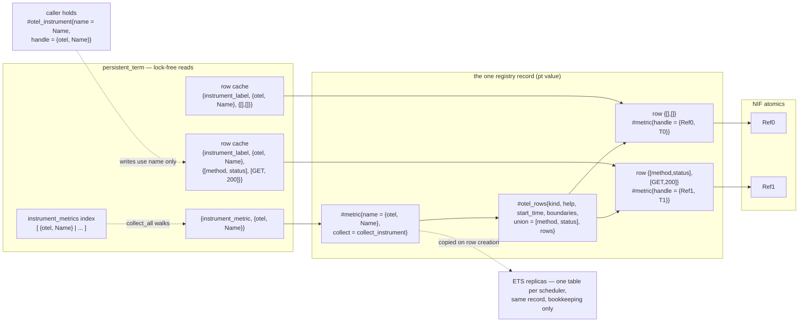

The row-cache entries and the record's `rows` map point at the **same** row records; the cache exists so the write fast path resolves a row with a single pt get, without touching the (potentially large) parent record.

### Data-structure inventory: who reads it, who writes it, why it exists

**New in this design**

- **`#otel_rows{}`** — the instrument container; the `handle` of the one registry record.
  - *Read:* every scrape (`collect_instrument` takes kind/help/start_time/union/rows); every slow-path write (membership re-check, `map_size(rows)` cardinality pre-check, histogram `boundaries`); unregister (cleanup walks it).
  - *Written:* once at `create_*` (kind, help, start_time, boundaries); once per new attribute set (gen_server adds the row, merges the union, re-puts the record).
  - *Why:* the stored answer to "which rows, union, and metadata belong to this instrument" — the identity A1 re-derived every scrape. Replaces the per-key-set `#vector` records, the `{otel_instrument_vecs}` side-table, `otel_name_index/0`, and `group/2`.

- **`rows` map** (`#{Canon => row #metric{}}`, inside `#otel_rows`).
  - *Read:* every scrape (folded, one NIF read per row); slow path (does this attribute set exist?); unregister (drives cache erasure and exemplar cleanup — no external "what to clean" tracking needed).
  - *Written:* by the gen_server only, once per new attribute set.
  - *Why:* the single enumerable home of all series of one instrument, including `{[],[]}` for unlabeled writes. Collect needs no registry scan to find series, and the phantom is impossible: a row exists iff it was written.

- **row `#metric{}` wrappers** — one per attribute set; the *same terms* appear as `rows` values and as row-cache values.
  - *Read/written:* every steady-state write (`WriteFun` NIF op on its handle); every scrape (per-kind getter); unregister (histogram exemplar cleanup).
  - *Why:* identical shape to today's `#vector.labels_map` rows, so every existing per-kind operation (`inc_counter`, `set_gauge`, `observe_histogram`, the getters, `instrument_histogram:cleanup`) works unmodified — no new storage primitive. Counter rows carry per-row `{Ref, StartTime}`, preserving first-observation times for future per-row OTLP start_time.

- **`Canon`** (`{Names, Values}`) — the canonical attribute form; a key shape, not a store.
  - *Produced:* on every write by `attrs_to_labels/1` (names sorted, values normalized by `to_label_value/1`).
  - *Used:* as the `rows` key and the row-cache key's third element.
  - *Why:* one stable identity per logical attribute set, independent of map ordering and value types (`200` vs `<<"200">>` land on the same row). Row identity without baking label names into metric names — the original mangling bug.

- **`union`** (sorted label-name list, inside `#otel_rows`).
  - *Read:* every scrape — emitted as the entry's `labels`; Prometheus pads each row against it.
  - *Written:* `lists:umerge` at row creation, the only moment it can change.
  - *Why:* Prometheus requires one fixed label column set per family while OTel permits per-row key-sets; storing the union removes A1's per-scrape `usort` + re-union.

- **row cache** (pt `{instrument_label, {otel, Name}, Canon} → row #metric{}`).
  - *Read:* **every write** — the fast path's single get.
  - *Written:* once per row at creation (a fresh put — no literal-GC sweep); erased at unregister, driven by the rows map.
  - *Why:* resolves attrs → row in one lock-free get without touching the potentially large parent record on the hot path. Reuses today's `instrument_label` prefix, so the registry's existing unregister/restart sweeps already cover it.

- **overflow sentinel** (pt `{instrument_label_overflow, {otel, Name}} → overflow row`).
  - *Read:* slow-path writes once the instrument is at the cardinality limit.
  - *Written:* once, via the gen_server, on first overflow.
  - *Why:* overflow happens exactly when write volume is high, so overflowed writes must stay off the gen_server; the row itself is the OTel-spec `otel.metric.overflow` series.

**Pre-existing, kept — their role here**

- **registry entry homes** — pt `{instrument_metric, {otel, Name}}`, the per-scheduler ETS tables, and the pt `instrument_metrics` name list.
  - *pt entry:* the read path — every scrape (`lookup/1`) and every slow-path write.
  - *ETS replicas:* registry bookkeeping (registration existence checks, `with/2` fallback); re-inserted on each row creation — the reason creation costs (schedulers + 1) × record size.
  - *name list:* what `collect_all/0` walks each scrape; written only by the gen_server.
  - *Why kept:* the library's standard registered-metric plumbing, unchanged; the design's change is that one meter instrument contributes **one** entry instead of 1 + K.

- **instrument descriptor** — pt `{otel_instrument, Name}` (`#otel_instrument{}`) and the pt `otel_instruments` name list.
  - *Read:* `get_instrument/1` (create-time dedup), `list_instruments/0`, `collect_observables/0` (locating callbacks), the exporter's unit lookup.
  - *Written:* at create / unregister only.
  - *Why kept:* the public meter-API descriptor. Changed within it: `handle` no longer holds storage — just `{otel, Name}` (or `{observable, RegName, Callback}`) — so callers cannot hold stale storage references.

- **label accounting** — ETS `instrument_label_counts` rows `{count, Name}` and `{dropped, Name}`.
  - *Read:* the public `label_count/1` / `cardinality_dropped/1` APIs.
  - *Written:* `cache_label` increments count at row creation; overflow routing increments dropped.
  - *Why kept:* API parity only — the limit check itself now uses `map_size(rows)`, which is exact and free.

## 4. Write path

All of `add/3`, `record/3`, `set/3` — labeled and unlabeled — funnel into one function. The API clauses keep their kind/sign guards (`counter` requires `Value >= 0`, up_down_counter sign-splits to `inc_gauge`/`dec_gauge`) and select a `WriteFun`; the six near-duplicate `do_add`/`do_record`/`do_set` clause pairs collapse.

```erlang
do_write(RegName, Attrs, WriteFun) ->
  Canon = attrs_to_labels(Attrs),   %% {Names, Values}; {[], []} when Attrs =:= #{}
  case persistent_term:get({instrument_label, RegName, Canon}, undefined) of
    #metric{} = Row -> WriteFun(Row);                  %% one NIF op
    undefined       -> slow_write(RegName, Canon, WriteFun)
  end.
```

```
master, attributed:  sort attrs → build vec-name binary → pt get (vec) → pt get (row) → NIF
B,      attributed:  sort attrs → pt get (row) → NIF
master, unlabeled:   pt get (ensure_base_registered, A1) → NIF
B,      unlabeled:   pt get (row cache, key {[],[]}) → NIF
```

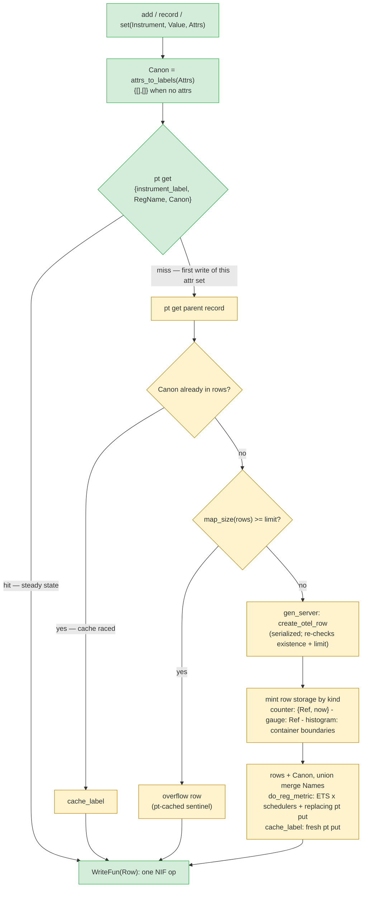

*Green: runs on every write. Amber: runs once per (instrument, attribute-set) — the agreed "init moment".*

**Slow path** — once per distinct attribute set over the instrument's lifetime:

1. pt get the parent record. Parent missing (unregistered/racing teardown) → `{error, not_found}`. If `rows` already holds `Canon` (cache raced/wiped) → `cache_label` + write.
2. Cardinality pre-check **outside** the gen_server: `map_size(rows) >= limit` → route to the overflow row (§7). Sustained overflow never touches the gen_server.
3. Else `gen_server:call(instrument_registry, {create_otel_row, RegName, Canon})`:
   - re-check existence and cardinality under serialization (race losers get the winner's row / the overflow row);
   - mint the row by kind (per-row start time for counters; container boundaries for histograms);
   - update the container: `rows#{Canon => Row}`, `union = lists:umerge(Union, Names)` (`Names` arrives sorted);
   - `do_reg_metric` (ETS tables + replacing pt put), cache the row (fresh-key pt put — skipped if a racing writer already cached it, since putting over an existing key is a *replacing* put and would schedule a needless literal-GC sweep; note today's `cache_label/3` puts unconditionally, so the row-store path caches only-if-absent; the put increments the `{count, RegName}` accounting), return the row.
4. Write.

Same serialization pattern as `create_vector_metric` today: creation is single-writer; fast-path readers see atomic pt snapshots; the worst race outcome is a redundant gen_server round-trip returning the existing row.

*Considered and rejected:* keying the cache by the raw attrs map (skips the sort) — several raw forms (`200` vs `<<"200">>`) would alias one row, complicating cleanup. Canonicalization happens on every write today; not a regression.

## 5. Collect path

```erlang
collect_instrument(RegName) ->
  #metric{handle = #otel_rows{kind = Kind, help = Help, start_time = T0,
                              union = Union, rows = Rows}} =
    instrument_registry:lookup(RegName),                          %% 1 pt get
  Data = maps:fold(fun({Names, Values}, Row, Acc) ->
                     [{Names, Values, read_row(Kind, Row)} | Acc] %% 1 NIF read per row
                   end, [], Rows),
  #{name => RegName, type => wire_type(Kind), help => Help,
    start_time => T0, labels => Union, data => Data}.
```

- `read_row`: existing getters — `get_counter` / `get_gauge` / `get_histogram` (observables read as gauges).
- `wire_type`: `counter | observable_counter → counter`; `up_down_counter | gauge | observable_gauge | observable_up_down_counter → gauge`; `histogram → histogram`. (Moves to the meter; `instrument_vector:wire_type/1` remains for standalone vecs.)
- The emitted map is final: name, type, help, stored union, rows. Data-point/row order is unspecified (map iteration) — semantically irrelevant in both Prometheus and OTLP.

**Formatters return to dumb:**

- `instrument_prometheus:format/0` and `instrument_metrics_exporter:collect_metrics/0` call `instrument_registry:collect_all()` directly; the `instrument_otel_streams:group/1` wrapper is deleted from both.
- New skip clause in each: `data := []` emits nothing. That is the entire phantom story: a created-but-never-written instrument collects an empty row set and produces no output (matches OTel SDKs). Note the registration mechanism differs from A1 (eager entry + empty-data skip, vs A1's lazy base registration) but the observable behavior is identical: nothing exported until first write.
- Prometheus labeled clauses read the union from the entry's `labels` key (which `instrument_vector:collect/1` also already provides) instead of recomputing; `union_labels/1` is deleted. `pad_row/3` stays for heterogeneous rows, with a fast first clause `pad_row(Union, Union, Vals) -> Vals` — the common case (single key-set; every standalone vec) pads for free.
- Unlabeled-only output bytes are identical to today: a `{[], [], Val}` row under an empty union renders `requests_total 42`.

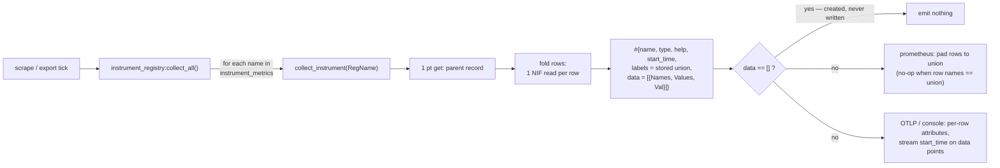

## 6. OTLP/console exporter changes

- **Free fix:** the labeled `convert_metric` clauses currently drop `start_time` (`instrument_metrics_exporter.erl:287-298`; only scalar clauses carry it), so attributed cumulative counters/histograms export OTLP data points with no start timestamp today. The labeled counter/histogram clauses now take `start_time` from the collect map (stream-level = instrument creation time — same value the scalar clause carried for base-only instruments). Per-row start times exist in storage (each counter row's `{Ref, StartTime}`) if finer granularity is ever wanted; out of scope.
- `data := []` → `undefined` skip clause (before the labeled clauses).
- `{otel_vec, _}` clauses in `get_instrument_unit/1` and `to_binary/1` deleted — the tag no longer exists. Likewise prometheus `format_name/1`'s `{otel_vec, _}` clause and `instrument_test:name_matches/2`'s.

## 7. Cardinality and overflow

- The limit check moves to the slow path only (existing rows are always writable, as today) and becomes `map_size(rows) >= instrument_config:get_metric_cardinality_limit()` — exact, no ETS read.
- **Per instrument**, as the OTel spec defines it. Today it is per key-set vec: one instrument writing K key-sets can hold K× the configured limit. Behavior change, documented (§11).
- The overflow series is the spec's overflow attribute set — one ordinary row keyed `{[<<"otel.metric.overflow">>], [<<"true">>]}` — replacing today's per-vec sentinel-filled label sets. It joins the union and collects like any row. Its handle is cached at `{instrument_label_overflow, RegName}` (existing prefix, already covered by unregister and restart cleanup), so sustained overflow stays fast: parent pt get (pre-check) + sentinel pt get + NIF — the gen_server is involved only when the overflow row is first created (as with `get_or_create_overflow/1` today). The `{dropped, RegName}` ETS counter keeps feeding `cardinality_dropped/1`; `cache_label`'s `{count, RegName}` accounting keeps `label_count/1` reporting.

## 8. Observables

- `create_observable_*` registers the same container entry (kind preserved, e.g. `observable_counter`); the callback lives only in `#otel_instrument.handle = {observable, RegName, Callback}`. `create_observable_underlying/2` and `storage_type/1` are deleted.
- `collect_observables/0` (still invoked by the exporter before collection): 0-arity callback → `do_write(RegName, #{}, SetFun)`; 1-arity callback's `Observer(Value, Attrs)` → `do_write(RegName, Attrs, SetFun)`. `store_observable_observation/5` is deleted. All observable rows are gauge refs with set semantics (callbacks report absolute values); `wire_type` renders `observable_counter` as counter — today's three-site trick, now in one place.
- Per-cycle win: today every attributed observation re-runs `ensure_vec_metric` (name-binary build + lookups) on each collection tick; now it is the standard fast path.
- **Coordination:** open PR #9 (`observable-collection-context`) reworks the same `collect_observables` neighborhood. Whichever lands second rebases; the conflict is confined to the observable corner of `instrument_meter`.

## 9. Cleanup

- `instrument_registry:do_unreg_metric/1` already drives cleanup from the record being removed. Its two helpers gain `#otel_rows` clauses:
  - `erase_cached_labels/2`: walk `rows`, erase each `{instrument_label, RegName, Canon}`;
  - `release_exemplar_reservoirs/1`: walk `rows`, `instrument_histogram:cleanup(Row)` per row.
  (`{instrument_label_overflow, RegName}` is already erased for every metric.)
- `instrument_meter:unregister_instrument/1` shrinks to: `instrument_metric:unregister({otel, Name})` + erase the `{otel_instrument, Name}` descriptor + names-list update. `unregister_associated_vec_metrics/1` is deleted.
- Registry restart (`clear_instrument_persistent_terms/0`) already sweeps every pt prefix this design uses. Bonus fix: today's `{otel_instrument_vecs, Base}` entries are **not** in `is_instrument_key/1`'s prefix list and leak across registry restarts; the key ceases to exist.

## 10. Performance analysis

Hot-path contract (the point of the design):

| Path | master / A1 | this design |
|---|---|---|
| attributed write (steady) | sort + name-binary build + 2 pt gets + NIF | sort + 1 pt get + NIF |
| unlabeled write (steady) | 1 pt get (A1) + NIF | 1 pt get + NIF |
| collect, per instrument | per-vec collects w/ self-re-lookup + index build (2 pt gets/instrument) + rename + group fold + usort union (+ Prometheus re-union/pad) | 1 pt get + 1 NIF read per row (+ Prometheus pad, free for single key-set) |
| observable attributed observation | `ensure_vec_metric` every cycle | 1 pt get + NIF |

Costs — all concentrated on **row creation** (none on steady writes or scrapes). Verified multipliers: ETS records are replicated per scheduler (`instrument_lib:tables/0`); cardinality limit defaults to 2000.

1. **Row creation scales with the instrument's total row count** (new). Each creation rebuilds the record and copies it whole to pt **and** each scheduler's ETS table: (S+1) × O(rows). Cumulative over a ramp: quadratic in bytes (at the 2000 limit, ~100–200 KB record → ~2–3 MB copied per late creation on 16 schedulers). Master has the same quadratic per key-set vec, so this is worse by factor K (distinct key-sets, typically 1–3); the common K=1 case is byte-identical to master. Init-time only.
2. **One global literal-GC sweep per row creation** (inherited, count unchanged). The replacing pt put makes the old record dying garbage; the literal collector walks every process in the node. Exactly one replacing put per creation — same as master's `create_vector_metric`, one fewer than A1's first-key-set path. Fresh puts (row cache) don't sweep.
3. **Creation serializes through the registry gen_server** (inherited). Cold-start herds queue on one process (`gen_server:call` 5s timeout at the extreme). No new call types — one call per row, and the per-key-set vec-registration call disappears — but cost 1 makes late calls heavier near the limit.
4. **Per-write floor** (improved, not zero): `maps:to_list` + sort + value→binary conversions (`#{status => 200}` allocates `<<"200">>` every write) + composite-key hash/compare. Strictly cheaper than master; the remaining cost is inherent to an attrs-map-per-call API. Future lever: a bound-instrument API.
5. **Memory** (inherited shape): the record lives in S+1 full copies; rows also appear once each in the pt cache. Totals equal to master (same rows split across K records today).
6. **Mass cleanup** (inherited): unregistering an N-row instrument erases N pt keys → N dying literal areas. Admin-time; same as `erase_cached_labels` today.

Non-issues: scrapes never block on creation (pt snapshot reads); each creation's contiguous record copy gives the rows map compact literal-area locality at scrape time.

Escape hatch if 1/3 ever bite: move rows into a dedicated ETS table keyed `{RegName, Canon}` with the record holding only metadata — kills the O(rows) rebuild but re-adds an ETS walk per scrape, trading away exactly the scrape purity this design buys. Not pre-paid at a 2000-row ceiling.

## 11. Behavior changes to document (CHANGELOG / PR)

1. The two original fixes (same contract as A1): attributed meter data exports under the registered name as one stream; no phantom zero — instruments appear on first write.
2. Prometheus: an instrument written with several attribute key-sets renders as one family with unioned labels, absent keys empty-filled.
3. Cardinality limit applies **per instrument** for meter instruments (was per key-set); the overflow series is the OTel `otel.metric.overflow` attribute set (was per-vec sentinel labels).
4. OTLP data points for attributed counters/histograms gain `start_time` (previously absent).

## 12. Deleted / added / untouched

**Deleted:** `src/instrument_otel_streams.erl` + `test/instrument_otel_streams_SUITE.erl`; in `instrument_meter`: `otel_name_index/0`, `ensure_vec_metric/4`, `make_vec_name/2`, `label_suffix/1`, `track_vec_metric/2`, `unregister_associated_vec_metrics/1`, `ensure_base_registered/1`, `create_underlying_metric/3`, `create_observable_underlying/2`, `storage_type/1`, `store_observable_observation/5`, the `do_add`/`do_record`/`do_set` clause family; in `instrument_prometheus`: `union_labels/1`, the `{otel_vec,_}` `format_name` clause, the `group` call; in the exporter: the `group` call, `{otel_vec,_}` clauses; in `instrument_test`: the `{otel_vec,_}` `name_matches` clause.

**Added:** `#otel_rows` (instrument.hrl); in `instrument_meter`: container construction + registration inline in `create_instrument/4` / `create_observable_instrument/4` (replacing `create_underlying_metric/3`), `do_write/3` + `slow_write/3`, `collect_instrument/1`, `read_row/2`, `wire_type/1`; in `instrument_registry`: the `{create_otel_row, RegName, Canon}` `handle_call` + `#otel_rows` clauses in `erase_cached_labels/2` and `release_exemplar_reservoirs/1`; formatter/exporter: `data := []` skips, stored-union read, `pad_row` fast clause, labeled `start_time` pass-through.

**Untouched:** `#vector`, `instrument_vector`, the standalone `instrument_metric:*_vec` API and its semantics (including per-vec cardinality for standalone vecs); `find_view_boundaries/1`; `get_instrument/1` / `list_instruments/0`; `#otel_instrument.temporality`. Net: `instrument_meter` ends smaller than on master.

## 13. Test contract

- **Ported from the A1 branch** (assertions carry over nearly verbatim; they specify the externally-visible contract): single stream under the registered name; no mangled series (both `<name>_<labels>` and `<name>_vec_<labels>` shapes asserted absent); no phantom zero; Prometheus union + empty-fill; description preserved; attributed observable single-stream. The exporter suite's scalar-shape assertions adjust to the row shape (`data` + stream `start_time`).
- **New coverage:** per-instrument cardinality + overflow row (`otel.metric.overflow`); union maintenance across key-sets; unregister erases row caches and exemplar reservoirs; concurrent first-write of the same attribute set (race through the gen_server); created-never-written instruments emit nothing in both formats.
- **Must stay green unmodified:** `instrument_vector_SUITE`, `instrument_cardinality_SUITE` (standalone-vec semantics), `instrument_leaks_SUITE`, `instrument_race_SUITE`, `instrument_stress_SUITE`, e2e — the proof the public vec API is untouched. (If `instrument_cardinality_SUITE` turns out to cover meter-path cardinality, those cases move to the new per-instrument semantics; checked at planning time.)

## 14. Landing strategy

- Fresh implementation branch from master (`be7e75e`) — the upstream PR presents one coherent design, not A1 plus a rework. The `meter-attributed-path` branch remains the test-porting source until this lands, then is dropped (its PR was never opened).
- Independent of PR #10 (histogram OTLP): that PR changes `instrument_metrics_exporter_otlp.erl` (encode layer); this design changes `instrument_metrics_exporter.erl` (convert layer). Different files, either lands first.
- Overlaps PR #9 (`observable-collection-context`) only in the observables corner (§8); coordinate landing order.
- CHANGELOG: `## [Unreleased]` entries per §11.

---

## Appendix A — use-case sequence diagrams, before vs after

Conventions: *before* = master 1.1.3 storage (which the A1 branch shares; A1-only divergences are marked). Writes shown are attributed unless noted. Lanes: the calling process, `persistent_term` (pt), the registry gen_server, the per-scheduler ETS tables, NIF atomics.

Each use case is presented as: **Before** — what happens today; **After** — what happens in this design; **Delta** — *only* what changed (`−` removed, `+` added, `→` altered, closing with the net cost change).

### A.1 Instrument creation — `create_counter/2,3`

**Before:** mint the base NIF storage up front and eagerly register the base entry (master) — A1 instead defers that registration to the first unlabeled write. The caller's descriptor holds the whole base `#metric` record.

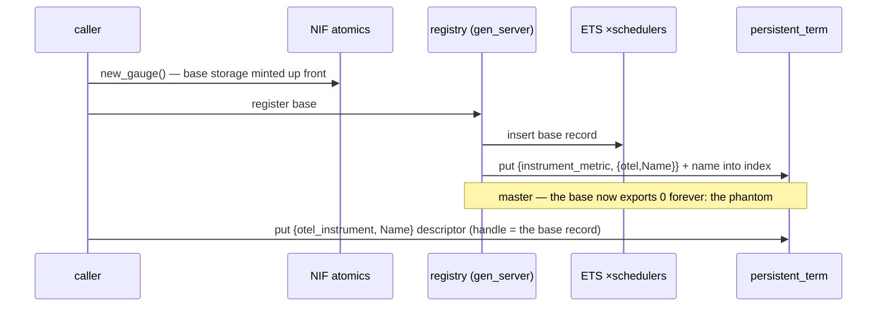

**After:** build the `#otel_rows` container and register the one entry under the real name; the descriptor holds just the name. No storage is allocated.

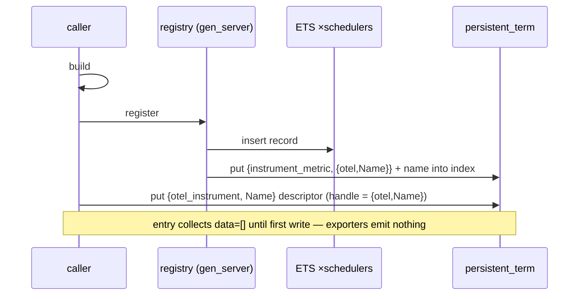

**Delta:**

- − NIF allocation at create — storage is now minted per row, at first write
- − the eagerly-registered base series (master's phantom zero) and − A1's lazy-registration hack — there is nothing to suppress
- \+ `#otel_rows` container (kind, help, start_time, boundaries) built once and registered under the real name
- → descriptor `handle`: full base `#metric` record → `{otel, Name}`
- net: one registration call either way; creation does strictly less work, and a never-written instrument emits nothing by construction

### A.2 Write, steady state — every write after the row exists

**Before:** every attributed write canonicalizes the attrs, rebuilds the derived vec-name binary, checks the vec exists (pt get 1), resolves the row (pt get 2), then does the NIF op. Unlabeled writes take a separate path through the descriptor's handle.

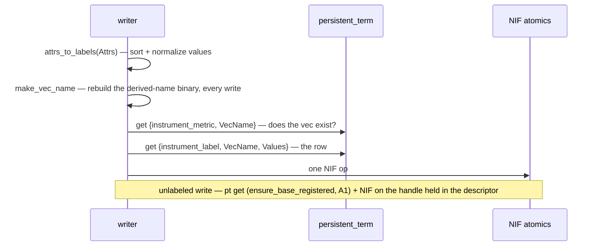

**After:** every write canonicalizes and resolves its row in one pt get, then the NIF op — the same path whether attributes are present or not.

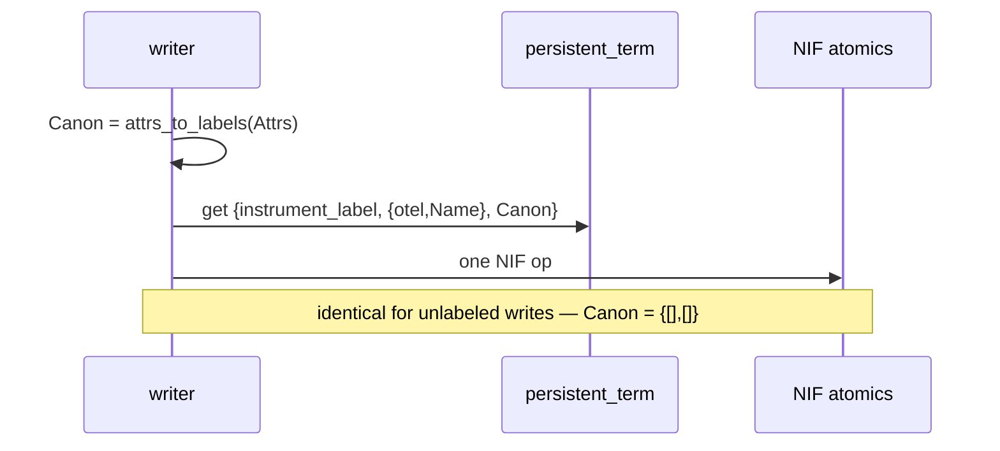

**Delta:**

- − `make_vec_name` derived-name binary built on every write
- − 1 pt get (the vec-existence check)
- − the separate unlabeled write path (and A1's `ensure_base_registered` get with it)
- → row-cache key: `{derived vec name, values}` → `{real name, Canon}`
- net per write: sort + binary build + 2 pt gets + NIF → sort + 1 pt get + NIF

### A.3 Write, first of a new attribute set — the paid "init moment"

**Before:** on a row-cache miss, first ensure the vec exists — for a new key-set that's a registration (gen_server call 1) plus the side-table put — then create the row (gen_server call 2, re-putting the grown vec record), cache it, write.

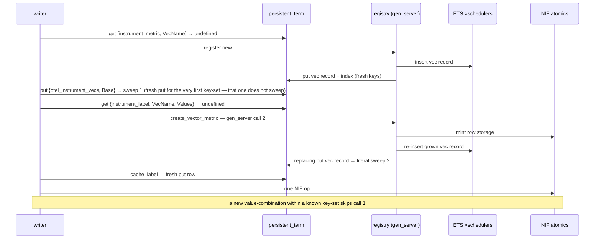

**After:** on a row-cache miss, read the parent once (row membership + exact cardinality), then one gen_server call mints the row, re-puts the record (rows + union), caches the row if absent, write.

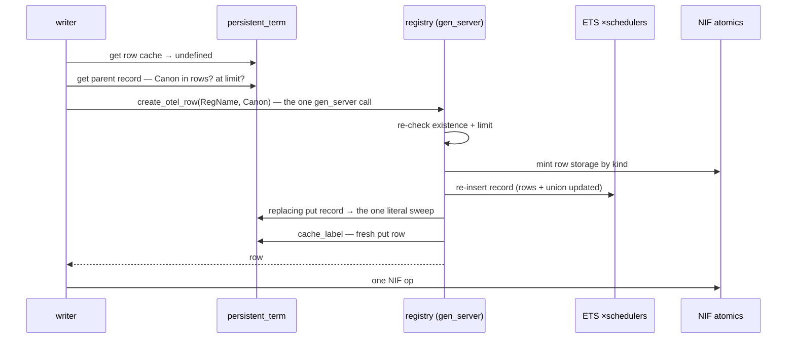

**Delta:**

- − 1 gen_server call (the vec registration; new-key-set case)
- − 1 literal-GC sweep (the side-table re-put; key-sets beyond the first)
- − `{otel_instrument_vecs}` side-table maintenance
- \+ exact `map_size` cardinality pre-check before the call (before: an ETS counter read on the label path)
- \+ union maintained at this moment (before: recomputed on every scrape)
- \+ cache only-if-absent rule — today's `cache_label` re-puts on races, which is a replacing put and a needless sweep
- → the record replaced per creation covers the whole instrument, O(all rows), instead of one key-set, O(that vec's rows) — §10 cost 1
- net per new attribute set: 1–2 calls and 1–2 sweeps → 1 call and 1 sweep (of the after-side's three storage writes, only the record re-put sweeps: ETS never touches the literal area; the cache put is a fresh key). Lifetime sweeps for R rows over K key-sets: R + K − 1 → R. Neither design sweeps on steady writes or scrapes.

### A.4 Collection — every scrape / export tick

**Before (A1):** collect every registry entry separately — the base and each vec, every vec re-looking itself up — then rebuild the name index from the descriptors and side-tables, rename every entry, group, union, and (Prometheus) re-union + pad.

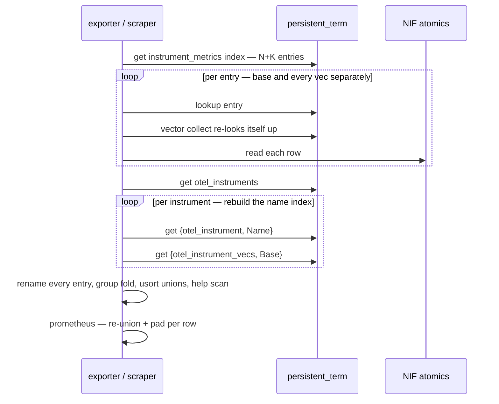

**After:** collect N entries; each reads its own record once and NIF-reads its rows; the formatters consume the stored union and skip empty instruments.

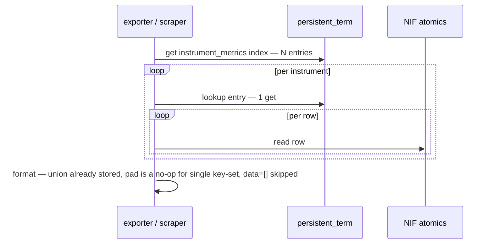

**Delta:**

- − K extra per-entry collects and the per-vec self-re-lookup
- − the name-index rebuild: 2 pt gets per instrument, every scrape, discarded after use
- − the rename pass, the grouping fold, the per-scrape `usort` unions, the `first_non_empty` help scan
- − Prometheus per-family union recompute (`union_labels/1`; it reads the entry's stored `labels` instead)
- \+ `data == []` skip clauses in both formatters (the phantom-suppression mechanism, moved to format time)
- \+ stream `start_time` on attributed OTLP data points (dropped entirely today)
- net per scrape: N+K collects + index build + grouping → N lookups + the irreducible per-row NIF reads

### A.5 Observable cycle — runs inside every export tick

**Before:** each observation, on every cycle, re-derives the vec name and re-checks vec existence before resolving its row.

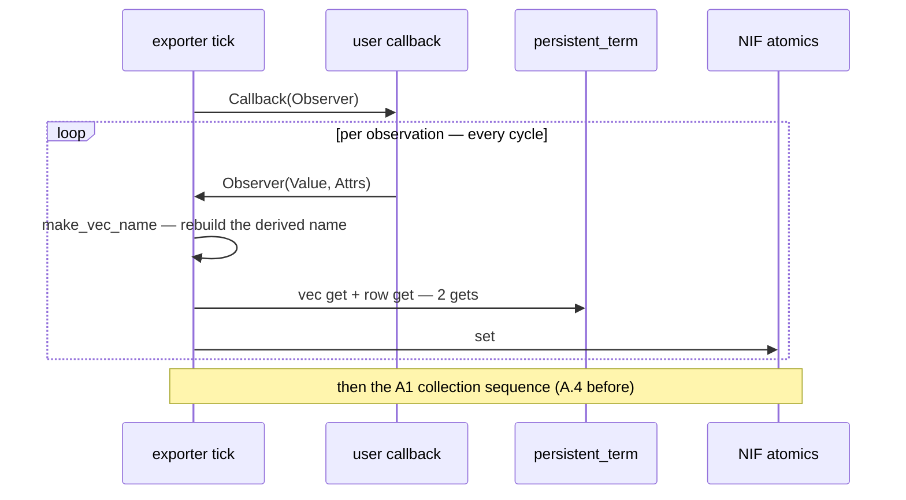

**After:** each observation is a standard fast-path write.

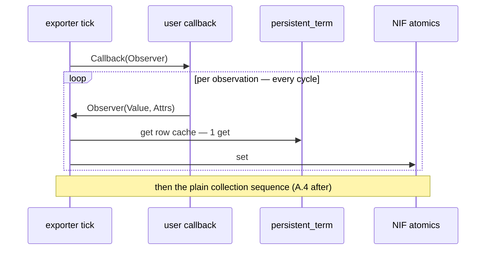

**Delta:**

- − `make_vec_name` + the vec-existence pt get, per observation, per cycle
- − the observable-only write path (`store_observable_observation`, `storage_type`) — observables use the same `do_write` as sync instruments
- net per observation: binary build + 2 pt gets + NIF → 1 pt get + NIF

### A.6 Unregister — admin-time

**Before:** unregister the base entry, read the side-table, unregister each vec with its own gen_server call, then erase the side-table and the descriptor.

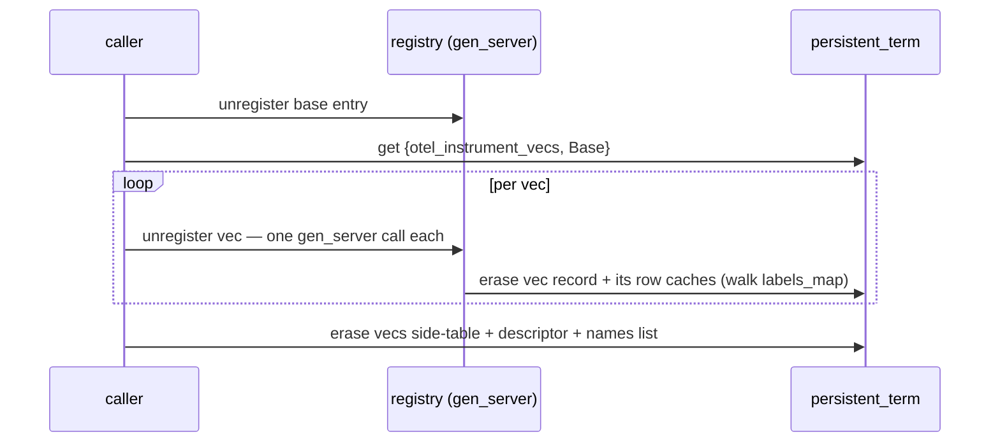

**After:** one unregister call — the registry walks the rows map, erasing row caches and running exemplar cleanup — then erase the descriptor.

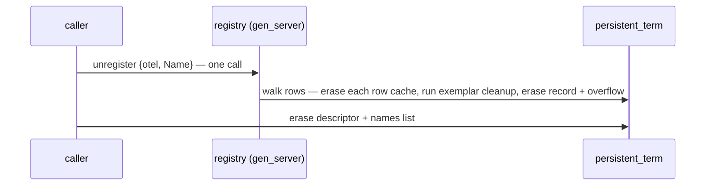

**Delta:**

- − K gen_server calls (one per vec)
- − the side-table read + erase (and, with the key itself, its registry-restart leak)
- \+ `#otel_rows` clauses in the registry's two cleanup helpers — the rows map is the cleanup manifest, no external tracking
- net: 1 + K calls → 1 call
